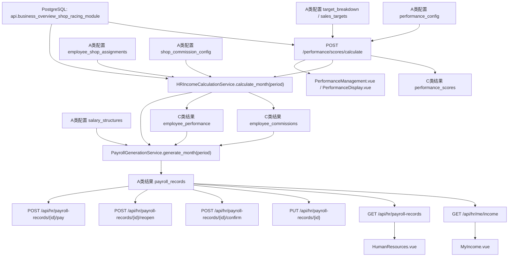
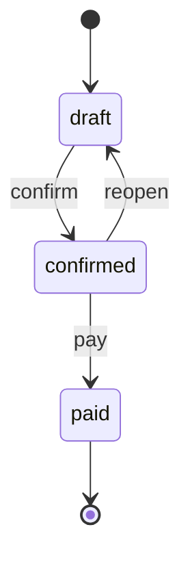

# HR Income Payroll End-to-End

## Goal

给出当前代码实现下，“绩效管理 -> 工资单 -> 我的收入”的端到端链路，明确：

- 配置层使用哪些表
- 计算层如何串联
- 结果层如何落表
- 前端分别从哪里读

## End-to-End Flow

## Table Roles

### 配置层

- `performance_config`
  - 店铺绩效权重与满分配置
- `target_breakdown`
  - 店铺目标拆解、目标金额、利润目标等
- `sales_targets`
  - 重点商品目标、运营目标
- `employee_shop_assignments`
  - 员工负责哪些店铺、提成比例是多少
- `shop_commission_config`
  - 每个店铺当月可分配利润率
- `salary_structures`
  - 固定薪资、岗位工资、补贴、绩效比例

### 中间结果层

- `performance_scores`
  - 店铺绩效得分结果
- `employee_commissions`
  - 员工提成结果
- `employee_performance`
  - 员工绩效结果

### 最终结算层

- `payroll_records`
  - 当前唯一最终收入口径
  - `draft / confirmed / paid`

## Backend Chain

### 1. 店铺绩效重算

入口：

- `backend/routers/performance_management.py`
- `POST /performance/scores/calculate`

逻辑：

1. 读取 `performance_config`
2. 优先使用 `target_breakdown`
3. 不足时回退 `api.business_overview_shop_racing_module`
4. 计算：
   - 销售额维度
   - 毛利维度
   - 重点商品维度
   - 运营维度
5. 写入 `performance_scores`

### 2. 个人提成与个人绩效重算

入口：

- `backend/services/hr_income_calculation_service.py`
- `HRIncomeCalculationService.calculate_month(period)`

逻辑：

1. 读取 `employee_shop_assignments`
2. 读取 `shop_commission_config`
3. 读取 `api.business_overview_shop_racing_module`
4. 对每个员工汇总：
   - 销售占比
   - 提成金额
   - 加权达成率
   - 绩效分
5. 写入：
   - `employee_commissions`
   - `employee_performance`

### 3. 工资单生成

入口：

- `backend/services/payroll_generation_service.py`
- `PayrollGenerationService.generate_month(period)`

逻辑：

1. 读取：
   - `salary_structures`
   - `employee_commissions`
   - `employee_performance`
   - 当月已有 `payroll_records`
2. 自动计算：
   - `base_salary`
   - `position_salary`
   - `allowances`
   - `commission`
   - `performance_salary`
   - `gross_salary`
   - `total_deductions`
   - `net_salary`
   - `total_cost`
3. 对 `draft`：
   - 自动字段允许覆盖
   - 人工字段保留
4. 对 `confirmed / paid`：
   - 不覆盖
   - 返回 `locked_conflict_details`
5. 写回 `payroll_records`

## Payroll State Flow

规则：

- `draft`
  - 可编辑人工字段
  - 可被重算自动刷新自动字段
- `confirmed`
  - 不可被自动覆盖
  - 可退回 `draft`
- `paid`
  - 仅做内部记录
  - 当前已具备管理员权限控制与审计留痕
  - 尚未联动外部支付 API

## Frontend Read Paths

### 绩效管理 / 绩效公示

- `frontend/src/views/hr/PerformanceManagement.vue`
- `frontend/src/views/hr/PerformanceDisplay.vue`

使用：

- `api.calculatePerformanceScores(period)`
- `api.getPerformanceScores(...)`

行为：

- 触发重算
- 若存在锁定工资单，弹出冲突摘要

### 我的收入

- `frontend/src/views/hr/MyIncome.vue`

使用：

- `api.getMyIncome(yearMonth)`

行为：

- 只读工资单口径
- 顶层金额显示 `net_salary`
- 明细展示完整工资单字段
- 无工资单时显示空态

### 工资单管理

- `frontend/src/views/HumanResources.vue`

使用：

- `api.getHrPayrollRecords(...)`
- `api.updateHrPayrollRecord(id, data)`
- `api.confirmHrPayrollRecord(id)`
- `api.reopenHrPayrollRecord(id)`
- `api.markHrPayrollRecordPaid(id)`

行为：

- `draft` 可编辑
- `draft` 可确认
- `confirmed` 可退回草稿
- `confirmed` 对管理员可标记已发放

## Current Boundary Summary

### 已闭环

- 店铺绩效重算
- 个人提成重算
- 个人绩效重算
- 工资单自动生成
- 我的收入统一到工资单口径
- 工资单 `draft -> confirmed -> paid` 内部状态流转
- 锁定冲突明细返回
- 锁定冲突可读文案提示
- `paid` 权限控制
- `paid` 审计记录

### 仍属后续扩展

- 外部支付 / 财务系统联动
- 冲突明细在 HR 页面里的专门列表化展示
- 更细粒度的工资单权限模型
