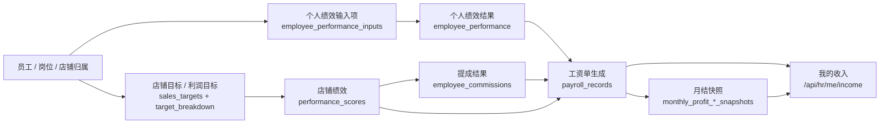

# HR 收入链路最终校验图（2026-05-30）

> 目的：把“输入 -> 输出 -> 我的收入”主链路的真实真源、当前参与项、锁定状态和未纳入口径一次性画清楚，作为最终验收与后续交接依据。

## 1. 结论

当前系统的员工收入主链路已经可用，且“我的收入”模块坚持工资单真源，不再反向拼装中间表。

```text
输入层 -> 绩效层 -> 提成层 -> 工资单层 -> 我的收入层
```

当前正式参与工资计算的核心口径：

- 固定薪资 = 底薪 + 岗位工资 + 固定补贴
- 绩效工资 = 绩效包 × 个人绩效系数
- 提成 = 店铺利润基数 × 可分配利润率 × 个人提成比例 × 店铺绩效系数

重点商品维度 `key_product` 当前不纳入正式口径，保留为未来扩展位。

## 2. 链路总图



## 3. 分层说明

### 3.1 输入层

#### 个人绩效输入项

- 表：`a_class.employee_performance_inputs`
- 用途：记录员工月度绩效的原始输入
- 当前状态：已可用
- 来源：管理员在“绩效管理 / 人员”页面维护，或套用默认模板

#### 店铺目标 / 分解

- 表：`a_class.sales_targets`
- 表：`a_class.target_breakdown`
- 用途：承接店铺层目标和分解
- 当前状态：`sales / profit / operation` 可用，`key_product` 暂不纳入正式口径

### 3.2 绩效层

#### 店铺绩效

- 表：`c_class.performance_scores`
- 当前正式参与维度：
  - `sales`
  - `profit`
  - `operation`
- 当前不纳入正式口径：
  - `key_product`

#### 个人绩效结果

- 表：`c_class.employee_performance`
- 计算来源：
  - 个人绩效输入项
  - 考勤调整
  - 人工调整
  - 仅在缺少个人输入时才回退店铺绩效

### 3.3 提成层

- 表：`c_class.employee_commissions`
- 计算来源：
  - 店铺利润基数
  - 可分配利润率
  - 个人提成比例
  - 店铺绩效系数

### 3.4 工资单层

- 表：`a_class.payroll_records`
- 计算来源：
  - 固定薪资
  - 绩效工资
  - 提成
  - 奖金 / 补贴 / 扣款

工资单状态：

- `draft`：可编辑、可重算
- `confirmed`：锁定，不再自动覆盖
- `paid`：只读，不可回退

### 3.5 我的收入层

- 接口：`GET /api/hr/me/income`
- 当前行为：
  - 只读工资单
  - approved 月份优先读 payroll snapshot
  - draft 月份读运行态工资单

## 4. 当前真实链路状态

### 已可用

- 个人绩效输入
- 个人绩效模板
- 店铺绩效 `sales / profit / operation`
- 提成结果
- 工资单生成
- 我的收入展示
- 月结 snapshot
- 员工收入审计页

### 未纳入正式口径

- `key_product`

### 仍需治理

- `target_breakdown` 历史重复数据的进一步清理
- schema 漂移持续对齐
- 旧乱码文件持续清理

## 5. 以李四（EMP260004）2026-03 为例

当前验证结果：

- 个人绩效输入已存在
- 个人绩效结果：`85.0`
- 提成结果：`166.53`
- 工资单实发：`5946.53`
- 我的收入：正确展示工资单结果
- 店铺绩效：`sales / profit / operation` 已可用，`key_product` 未纳入正式口径

## 6. 验收判断

在不包含 `key_product` 的前提下，当前主链路已经满足：

- 可计算
- 可展示
- 可解释
- 可审计

可以作为当前阶段可验收版本收口。
