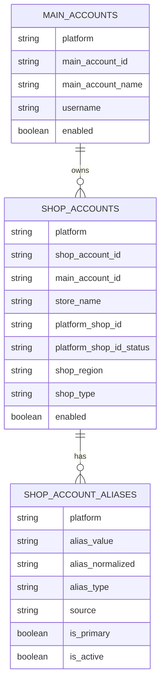

# 账号管理梳理：平台 → 账号（主账号）→ 店铺（店铺账号）→ 店铺别名

适用目的：把本项目「账号管理」模块的关键概念与落库/接口字段梳理清楚，便于将同一套关系录入到其他系统。

> 本文基于当前仓库实现（后端 FastAPI + PostgreSQL，表位于 `core` schema）。如需“导出一份你们当前线上数据的清单”，可以在本文确定字段口径后，再补一份 SQL 导出模板。

---

## 1. 概念与层级（你要录入的四层）

### 1) 平台（Platform）
- 含义：电商平台代码，用于区分同名账号/店铺的归属。
- 字段口径：`platform`（字符串，示例：`shopee` / `tiktok` / `amazon` / `lazada` / `miaoshou` 等）

### 2) 账号（主账号 / Main Account）
- 含义：可用于登录平台后台、承载会话/采集的“主登录账号”。一个主账号可绑定多个店铺（多店铺）。
- 核心标识：`main_account_id`（业务唯一 ID）

### 3) 店铺（店铺账号 / Shop Account）
- 含义：主账号下的具体店铺采集目标；用于业务侧、指标侧等统一引用。
- 核心标识：`shop_account_id`（业务唯一 ID）
- 关键外键：`main_account_id`（归属到主账号）
- 平台店铺ID：`platform_shop_id`（平台侧 shop_id；可为空，且有状态字段追踪是否缺失/人工确认）

### 4) 店铺别名（Shop Alias / Shop Account Alias）
- 含义：把各种“原始店铺标签/店铺名/来源字段”映射到某个标准的店铺账号（`shop_account_id`），用于对齐订单/流水等事实表里出现的店铺名。
- 典型来源：订单数据里出现的店铺名称、第三方系统导出的店铺标识、历史手工命名等。
- 关键点：
  - 一个店铺可以有多个别名
  - 可指定 1 个“主别名”（`is_primary=true`）
  - 别名可停用（`is_active=false`），用于保留历史但不再参与匹配

---

## 2. 数据模型（推荐录入到其他系统的主干口径）

建议你在其他系统里至少保留下面这 4 张“逻辑表/实体”（字段可按你们对方系统裁剪）：

> 备注：本项目实现里，`SHOP_ACCOUNT_ALIASES` 实际外键连的是 `shop_accounts.id`（数值自增主键），但接口层“认领别名”时使用的是 `shop_account_id`（业务 ID）来定位目标店铺。迁移到其他系统时，建议直接把别名绑定到你们的“店铺业务ID（shop_account_id）”以降低耦合。

---

## 3. 本项目落库表（core schema）与关键字段

### 3.1 `core.main_accounts`（主账号）
- `platform`：平台代码
- `main_account_id`：主账号业务 ID（唯一）
- `main_account_name`：主账号展示名（可空）
- `username`：登录用户名
- `password_encrypted`：加密后的密码（敏感；对外系统通常不需要）
- `login_url`：登录 URL（可空）
- `enabled`：是否启用
- `notes` / `extra_config`：备注/扩展配置（可空）

### 3.2 `core.shop_accounts`（店铺账号）
- `platform`：平台代码
- `shop_account_id`：店铺账号业务 ID（唯一）
- `main_account_id`：归属主账号业务 ID（外键到 `core.main_accounts.main_account_id`）
- `store_name`：店铺名称（标准店铺名）
- `platform_shop_id`：平台店铺ID（可空）
- `platform_shop_id_status`：`missing` / `manual_confirmed` 等（用于追踪 platform_shop_id 是否缺失、是否人工确认）
- `shop_region`：站点/区域（可空，例如 SG/MY 等）
- `shop_type`：店铺类型（可空，例如 `local` / `global`）
- `enabled`：是否启用
- `notes` / `extra_config`：备注/扩展配置

### 3.3 `core.shop_account_aliases`（店铺别名）
- `shop_account_id`：外键（指向 `core.shop_accounts.id` 这个数值主键）
- `platform`：平台代码
- `alias_value`：别名原值（人可读）
- `alias_normalized`：规范化后的别名键（用于匹配）
- `alias_type`：别名类型（可空；在“认领”流程会设置为 `claimed`）
- `source`：来源（可空；在“认领”流程默认 `manual_claim`）
- `is_primary`：是否主别名（一个店铺最多允许 1 个“启用中的主别名”）
- `is_active`：是否启用

### 3.4（可选）`core.shop_account_capabilities`（店铺数据域能力）
- 含义：每个店铺在不同数据域（orders/products/services/...）是否启用。
- 如果你仅做“平台-账号-店铺-别名”录入，可不迁移此表；若对方系统也需要采集域控制，再纳入。

---

## 4. 约束与唯一性（外部系统录入时最容易踩坑的点）

### 4.1 主账号唯一性
- `main_account_id` 必须全局唯一（同平台下重复也不允许）

### 4.2 店铺账号唯一性
- `shop_account_id` 必须全局唯一
- 另外还有一个“平台 + 平台店铺ID”的唯一性约束：同一 `platform` 下 `platform_shop_id` 不应重复绑定到多个店铺（当 `platform_shop_id` 非空时）

### 4.3 别名唯一性与主别名规则
- 活跃别名唯一：同一 `platform` 下，`alias_normalized` 在 `is_active=true` 的集合里应唯一（避免一个别名同时指向多个店铺）
- 主别名唯一：同一店铺在 `is_active=true` 下最多一个 `is_primary=true`

---

## 5. 对应 API（便于你核对字段口径）

### 5.1 主账号
- `GET /api/main-accounts`：查询主账号列表
- `POST /api/main-accounts`：创建主账号
- `PUT /api/main-accounts/{main_account_id}`：更新主账号
- `DELETE /api/main-accounts/{main_account_id}`：删除主账号

### 5.2 店铺账号
- `GET /api/shop-accounts`：查询店铺账号列表（支持筛选参数：`platform` / `enabled` / `include_disabled` / `shop_type` / `main_account_id` / `search` 等）
- `POST /api/shop-accounts`：创建店铺账号
- `POST /api/shop-accounts/batch`：批量创建店铺账号
- `PUT /api/shop-accounts/{shop_account_id}`：更新店铺账号
- `DELETE /api/shop-accounts/{shop_account_id}`：删除店铺账号

### 5.3 店铺别名
- `GET /api/shop-account-aliases`：查询别名列表
- `POST /api/shop-account-aliases`：新增别名（底层需要 `core.shop_accounts.id` 数值主键）
- `POST /api/shop-account-aliases/claim`：认领别名到某个 `shop_account_id`（推荐用这个流程）
- `DELETE /api/shop-account-aliases/primary/{shop_account_id}`：清理某店铺的主别名（并停用旧主别名）
- `GET /api/shop-account-aliases/unmatched`：查询“订单事实表里出现但尚未匹配”的店铺别名候选

---

## 6. 建议的“可录入其他系统”的导入模板（字段清单）

你可以按下面 3 张表导入到对方系统（或导成 3 个 sheet）：

### 6.1 主账号导入表（Main Accounts）
必填：
- `platform`
- `main_account_id`
- `username`

建议填：
- `main_account_name`
- `login_url`
- `enabled`
- `notes`

### 6.2 店铺导入表（Shop Accounts）
必填：
- `platform`
- `shop_account_id`
- `main_account_id`
- `store_name`

建议填：
- `platform_shop_id`（如已知）
- `platform_shop_id_status`（如对方系统也需要追踪：缺失/人工确认）
- `shop_region`
- `shop_type`
- `enabled`
- `notes`

### 6.3 店铺别名导入表（Shop Aliases）
必填：
- `platform`
- `shop_account_id`（建议以业务 ID 绑定）
- `alias_value`

建议填：
- `alias_normalized`（如果对方系统也做匹配；否则可由对方系统按其规则生成）
- `is_primary`
- `is_active`
- `alias_type`
- `source`

---

## 7. 兼容/历史：`core.platform_accounts`（旧“平台账号表”说明）

仓库里还存在一张较早期的综合表 `core.platform_accounts`（同样包含 platform/store/shop_id/username/password/capabilities 等字段），并且部分业务模块（例如目标管理里取店铺列表）仍可能引用它。

但本次你提到的“平台-账号-店铺-店铺别名”梳理，按现有接口与页面的主干实现，应优先以：
- `core.main_accounts`（主账号）
- `core.shop_accounts`（店铺账号）
- `core.shop_account_aliases`（店铺别名）

作为对外录入/迁移口径。

